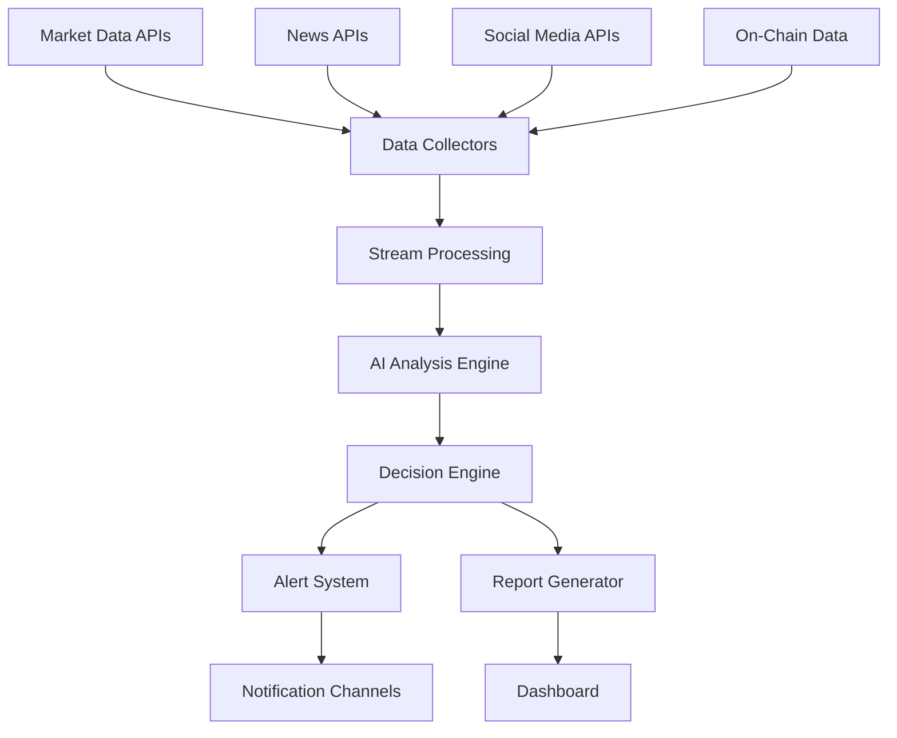

# Agente de IA Autónomo para Trading Crypto 24/7

## 🎯 Visión del Sistema

Un agente de IA completamente autónomo que opera 24/7, analiza múltiples fuentes de datos en tiempo real, detecta oportunidades de inversión y genera alertas inteligentes con reportes detallados.

## 🏗️ Arquitectura del Sistema

### Core Components



### 1. Sistema de Recolección de Datos (Data Collectors)

#### Fuentes de Datos en Tiempo Real
- **Market Data**: Binance, Coinbase, Kraken APIs
- **News**: CoinDesk, CoinTelegraph, CryptoNews APIs
- **Social**: Twitter API v2, Reddit API, Telegram
- **On-Chain**: Etherscan, Blockchain.info, Glassnode
- **Sentiment**: Fear & Greed Index, LunarCrush
- **Macro**: FRED API, Yahoo Finance

#### Tecnologías
```python
# Ejemplo de collector base
import asyncio
import aiohttp
from dataclasses import dataclass
from typing import Dict, Any
import websocket
import json

@dataclass
class DataPoint:
    source: str
    timestamp: float
    data_type: str
    content: Dict[Any, Any]
    confidence: float

class BaseCollector:
    def __init__(self, config: Dict):
        self.config = config
        self.is_running = False
        
    async def start_collection(self):
        self.is_running = True
        while self.is_running:
            try:
                data = await self.collect_data()
                await self.publish_data(data)
                await asyncio.sleep(self.config['interval'])
            except Exception as e:
                await self.handle_error(e)
                
    async def collect_data(self) -> DataPoint:
        # Implementación específica por fuente
        pass
```

### 2. Stream Processing Engine

#### Apache Kafka + Apache Flink
```yaml
# docker-compose.yml para infrastructure
version: '3.8'
services:
  zookeeper:
    image: confluentinc/cp-zookeeper:latest
    environment:
      ZOOKEEPER_CLIENT_PORT: 2181
      
  kafka:
    image: confluentinc/cp-kafka:latest
    depends_on:
      - zookeeper
    environment:
      KAFKA_BROKER_ID: 1
      KAFKA_ZOOKEEPER_CONNECT: zookeeper:2181
      KAFKA_ADVERTISED_LISTENERS: PLAINTEXT://localhost:9092
      
  flink:
    image: flink:latest
    ports:
      - "8081:8081"
    environment:
      - JOB_MANAGER_RPC_ADDRESS=flink
```

#### Stream Processing Logic
```python
# Flink Job para procesamiento en tiempo real
from pyflink.datastream import StreamExecutionEnvironment
from pyflink.table import StreamTableEnvironment

def create_stream_processing_job():
    env = StreamExecutionEnvironment.get_execution_environment()
    env.set_parallelism(4)
    
    # Configurar checkpointing para fault tolerance
    env.enable_checkpointing(5000)  # checkpoint cada 5 segundos
    
    # Stream de datos de mercado
    market_stream = env.add_source(MarketDataSource())
    
    # Stream de noticias
    news_stream = env.add_source(NewsDataSource())
    
    # Stream de redes sociales
    social_stream = env.add_source(SocialDataSource())
    
    # Unir streams y procesar
    unified_stream = market_stream.union(news_stream, social_stream)
    
    # Aplicar ventanas deslizantes
    windowed_stream = unified_stream.key_by(lambda x: x.symbol)\
                                   .time_window(Time.minutes(5))\
                                   .aggregate(DataAggregator())
    
    # Enviar a AI Engine
    windowed_stream.add_sink(AIEngineSink())
    
    env.execute("Crypto Analysis Stream")
```

### 3. AI Analysis Engine

#### Modelos de Machine Learning
```python
import tensorflow as tf
import numpy as np
from transformers import pipeline, AutoTokenizer, AutoModelForSequenceClassification
import pandas as pd

class AIAnalysisEngine:
    def __init__(self):
        self.price_predictor = self.load_price_model()
        self.sentiment_analyzer = self.load_sentiment_model()
        self.anomaly_detector = self.load_anomaly_model()
        self.pattern_recognizer = self.load_pattern_model()
        
    def load_price_model(self):
        """Modelo LSTM para predicción de precios"""
        model = tf.keras.Sequential([
            tf.keras.layers.LSTM(128, return_sequences=True, input_shape=(60, 5)),
            tf.keras.layers.Dropout(0.2),
            tf.keras.layers.LSTM(128, return_sequences=True),
            tf.keras.layers.Dropout(0.2),
            tf.keras.layers.LSTM(64),
            tf.keras.layers.Dense(25),
            tf.keras.layers.Dense(1)
        ])
        model.compile(optimizer='adam', loss='mean_squared_error')
        return model
        
    def load_sentiment_model(self):
        """Modelo transformer para análisis de sentiment"""
        return pipeline(
            "sentiment-analysis",
            model="ProsusAI/finbert",
            tokenizer="ProsusAI/finbert"
        )
        
    def load_anomaly_model(self):
        """Isolation Forest para detección de anomalías"""
        from sklearn.ensemble import IsolationForest
        return IsolationForest(contamination=0.1, random_state=42)
        
    async def analyze_market_data(self, data: Dict) -> Dict:
        """Análisis principal de datos de mercado"""
        results = {}
        
        # Predicción de precio
        price_prediction = await self.predict_price(data['price_data'])
        results['price_prediction'] = price_prediction
        
        # Análisis técnico
        technical_analysis = await self.analyze_technical_indicators(data)
        results['technical_analysis'] = technical_analysis
        
        # Detección de anomalías
        anomalies = await self.detect_anomalies(data)
        results['anomalies'] = anomalies
        
        # Score general de oportunidad
        opportunity_score = await self.calculate_opportunity_score(results)
        results['opportunity_score'] = opportunity_score
        
        return results
        
    async def analyze_sentiment(self, text_data: List[str]) -> Dict:
        """Análisis de sentiment de noticias y redes sociales"""
        sentiments = []
        for text in text_data:
            sentiment = self.sentiment_analyzer(text)
            sentiments.append(sentiment)
            
        # Agregación de sentimientos
        avg_sentiment = np.mean([s['score'] for s in sentiments])
        sentiment_trend = self.calculate_sentiment_trend(sentiments)
        
        return {
            'average_sentiment': avg_sentiment,
            'sentiment_trend': sentiment_trend,
            'sentiment_distribution': self.get_sentiment_distribution(sentiments)
        }
```

### 4. Decision Engine

#### Sistema de Reglas y Machine Learning
```python
from dataclasses import dataclass
from enum import Enum
from typing import List, Dict, Optional
import asyncio

class OpportunityType(Enum):
    BUY = "BUY"
    SELL = "SELL"
    HOLD = "HOLD"
    STRONG_BUY = "STRONG_BUY"
    STRONG_SELL = "STRONG_SELL"

@dataclass
class TradingOpportunity:
    symbol: str
    opportunity_type: OpportunityType
    confidence: float
    expected_return: float
    risk_level: float
    timeframe: str
    reasoning: List[str]
    supporting_data: Dict
    timestamp: float

class DecisionEngine:
    def __init__(self):
        self.rules = self.load_trading_rules()
        self.risk_manager = RiskManager()
        self.position_manager = PositionManager()
        
    async def evaluate_opportunity(self, analysis_results: Dict) -> Optional[TradingOpportunity]:
        """Evalúa si existe una oportunidad de trading"""
        
        # Filtros de calidad de datos
        if not self.validate_data_quality(analysis_results):
            return None
            
        # Análisis multi-factor
        factors = await self.calculate_decision_factors(analysis_results)
        
        # Aplicar reglas de trading
        decision = await self.apply_trading_rules(factors)
        
        # Gestión de riesgo
        if decision and await self.risk_manager.validate_trade(decision):
            return decision
            
        return None
        
    async def calculate_decision_factors(self, data: Dict) -> Dict:
        """Calcula factores de decisión ponderados"""
        factors = {}
        
        # Factor técnico (30%)
        technical_score = self.calculate_technical_score(data['technical_analysis'])
        factors['technical'] = {'score': technical_score, 'weight': 0.30}
        
        # Factor fundamental (25%)
        fundamental_score = self.calculate_fundamental_score(data)
        factors['fundamental'] = {'score': fundamental_score, 'weight': 0.25}
        
        # Factor de sentiment (20%)
        sentiment_score = self.calculate_sentiment_score(data['sentiment'])
        factors['sentiment'] = {'score': sentiment_score, 'weight': 0.20}
        
        # Factor de momentum (15%)
        momentum_score = self.calculate_momentum_score(data)
        factors['momentum'] = {'score': momentum_score, 'weight': 0.15}
        
        # Factor de riesgo (10%)
        risk_score = self.calculate_risk_score(data)
        factors['risk'] = {'score': risk_score, 'weight': 0.10}
        
        return factors
        
    async def apply_trading_rules(self, factors: Dict) -> Optional[TradingOpportunity]:
        """Aplica reglas de trading basadas en factores"""
        
        # Calcular score ponderado total
        total_score = sum(
            factor['score'] * factor['weight'] 
            for factor in factors.values()
        )
        
        # Reglas de decisión
        if total_score > 0.8:
            return TradingOpportunity(
                symbol=data['symbol'],
                opportunity_type=OpportunityType.STRONG_BUY,
                confidence=total_score,
                expected_return=self.calculate_expected_return(factors),
                risk_level=factors['risk']['score'],
                timeframe=self.determine_timeframe(factors),
                reasoning=self.generate_reasoning(factors),
                supporting_data=factors,
                timestamp=time.time()
            )
        elif total_score > 0.6:
            return TradingOpportunity(
                opportunity_type=OpportunityType.BUY,
                confidence=total_score,
                # ... otros campos
            )
        elif total_score < -0.6:
            return TradingOpportunity(
                opportunity_type=OpportunityType.SELL,
                confidence=abs(total_score),
                # ... otros campos
            )
            
        return None
```

### 5. Sistema de Alertas y Notificaciones

#### Multi-Channel Alert System
```python
import asyncio
import aiohttp
import smtplib
from telegram import Bot
import discord
from twilio.rest import Client

class AlertSystem:
    def __init__(self, config: Dict):
        self.config = config
        self.telegram_bot = Bot(token=config['telegram_token'])
        self.discord_webhook = config['discord_webhook']
        self.twilio_client = Client(config['twilio_sid'], config['twilio_token'])
        self.email_config = config['email']
        
    async def send_opportunity_alert(self, opportunity: TradingOpportunity):
        """Envía alertas por múltiples canales"""
        
        # Generar mensaje
        message = self.format_opportunity_message(opportunity)
        
        # Enviar por todos los canales configurados
        tasks = []
        
        if self.config.get('telegram_enabled'):
            tasks.append(self.send_telegram_alert(message, opportunity))
            
        if self.config.get('discord_enabled'):
            tasks.append(self.send_discord_alert(message, opportunity))
            
        if self.config.get('email_enabled'):
            tasks.append(self.send_email_alert(message, opportunity))
            
        if self.config.get('sms_enabled') and opportunity.confidence > 0.8:
            tasks.append(self.send_sms_alert(message, opportunity))
            
        await asyncio.gather(*tasks, return_exceptions=True)
        
    def format_opportunity_message(self, opp: TradingOpportunity) -> str:
        """Formatea mensaje de oportunidad"""
        emoji = "🚀" if opp.opportunity_type in [OpportunityType.BUY, OpportunityType.STRONG_BUY] else "⚠️"
        
        message = f"""
        {emoji} **OPORTUNIDAD DETECTADA** {emoji}
        
        **Símbolo**: {opp.symbol}
        **Tipo**: {opp.opportunity_type.value}
        **Confianza**: {opp.confidence:.2%}
        **Retorno Esperado**: {opp.expected_return:.2%}
        **Nivel de Riesgo**: {opp.risk_level:.2%}
        **Timeframe**: {opp.timeframe}
        
        **Razones**:
        {chr(10).join(f"• {reason}" for reason in opp.reasoning)}
        
        **Timestamp**: {datetime.fromtimestamp(opp.timestamp).strftime('%Y-%m-%d %H:%M:%S')}
        """
        
        return message
        
    async def send_telegram_alert(self, message: str, opportunity: TradingOpportunity):
        """Envía alerta por Telegram"""
        try:
            # Enviar mensaje de texto
            await self.telegram_bot.send_message(
                chat_id=self.config['telegram_chat_id'],
                text=message,
                parse_mode='Markdown'
            )
            
            # Enviar gráfico si está disponible
            if opportunity.supporting_data.get('chart'):
                await self.telegram_bot.send_photo(
                    chat_id=self.config['telegram_chat_id'],
                    photo=opportunity.supporting_data['chart']
                )
                
        except Exception as e:
            logger.error(f"Error enviando alerta Telegram: {e}")
```

### 6. Sistema de Reportes

#### Generador de Reportes Inteligentes
```python
import matplotlib.pyplot as plt
import pandas as pd
from jinja2 import Template
import pdfkit

class ReportGenerator:
    def __init__(self):
        self.templates = self.load_templates()
        
    async def generate_opportunity_report(self, opportunity: TradingOpportunity) -> Dict:
        """Genera reporte detallado de oportunidad"""
        
        # Recopilar datos adicionales
        market_context = await self.get_market_context(opportunity.symbol)
        historical_performance = await self.get_historical_performance(opportunity.symbol)
        risk_analysis = await self.perform_risk_analysis(opportunity)
        
        # Generar gráficos
        charts = await self.generate_charts(opportunity, market_context)
        
        # Crear reporte
        report_data = {
            'opportunity': opportunity,
            'market_context': market_context,
            'historical_performance': historical_performance,
            'risk_analysis': risk_analysis,
            'charts': charts,
            'generated_at': datetime.now()
        }
        
        # Generar HTML y PDF
        html_report = await self.generate_html_report(report_data)
        pdf_report = await self.generate_pdf_report(html_report)
        
        return {
            'html': html_report,
            'pdf': pdf_report,
            'data': report_data
        }
        
    async def generate_charts(self, opportunity: TradingOpportunity, context: Dict) -> Dict:
        """Genera gráficos para el reporte"""
        charts = {}
        
        # Gráfico de precio con señales
        fig, ax = plt.subplots(figsize=(12, 8))
        
        # Plot precio
        prices = context['price_history']
        ax.plot(prices.index, prices['close'], label='Precio', linewidth=2)
        
        # Plot señales técnicas
        if context.get('support_resistance'):
            ax.axhline(y=context['support_resistance']['support'], 
                      color='green', linestyle='--', label='Soporte')
            ax.axhline(y=context['support_resistance']['resistance'], 
                      color='red', linestyle='--', label='Resistencia')
        
        # Marcar punto de oportunidad
        ax.scatter(prices.index[-1], prices['close'].iloc[-1], 
                  color='gold', s=100, label='Oportunidad', zorder=5)
        
        ax.set_title(f'{opportunity.symbol} - Análisis Técnico')
        ax.set_xlabel('Fecha')
        ax.set_ylabel('Precio')
        ax.legend()
        ax.grid(True, alpha=0.3)
        
        # Guardar gráfico
        chart_path = f'/tmp/{opportunity.symbol}_price_analysis.png'
        plt.savefig(chart_path, dpi=300, bbox_inches='tight')
        charts['price_analysis'] = chart_path
        plt.close()
        
        # Gráfico de volumen
        fig, ax = plt.subplots(figsize=(12, 4))
        ax.bar(prices.index, prices['volume'], alpha=0.7)
        ax.set_title(f'{opportunity.symbol} - Volumen')
        ax.set_xlabel('Fecha')
        ax.set_ylabel('Volumen')
        
        volume_chart_path = f'/tmp/{opportunity.symbol}_volume.png'
        plt.savefig(volume_chart_path, dpi=300, bbox_inches='tight')
        charts['volume_analysis'] = volume_chart_path
        plt.close()
        
        return charts
```

### 7. Dashboard y Monitoreo

#### React Dashboard
```javascript
// Dashboard principal
import React, { useState, useEffect } from 'react';
import { Card, CardContent, CardHeader, CardTitle } from '@/components/ui/card';
import { Alert, AlertDescription } from '@/components/ui/alert';
import { Badge } from '@/components/ui/badge';

const TradingDashboard = () => {
  const [opportunities, setOpportunities] = useState([]);
  const [systemStatus, setSystemStatus] = useState({});
  const [marketOverview, setMarketOverview] = useState({});

  useEffect(() => {
    // WebSocket connection para datos en tiempo real
    const ws = new WebSocket('ws://localhost:8080/ws');
    
    ws.onmessage = (event) => {
      const data = JSON.parse(event.data);
      
      switch(data.type) {
        case 'opportunity':
          setOpportunities(prev => [data.payload, ...prev.slice(0, 19)]);
          break;
        case 'system_status':
          setSystemStatus(data.payload);
          break;
        case 'market_overview':
          setMarketOverview(data.payload);
          break;
      }
    };

    return () => ws.close();
  }, []);

  const getOpportunityColor = (type) => {
    switch(type) {
      case 'STRONG_BUY': return 'bg-green-500';
      case 'BUY': return 'bg-green-300';
      case 'SELL': return 'bg-red-300';
      case 'STRONG_SELL': return 'bg-red-500';
      default: return 'bg-gray-300';
    }
  };

  return (
    <div className="p-6 space-y-6">
      {/* Header */}
      <div className="flex justify-between items-center">
        <h1 className="text-3xl font-bold">Agente IA Trading 24/7</h1>
        <div className="flex space-x-2">
          <Badge variant="outline">
            Sistema: {systemStatus.status || 'Conectando...'}
          </Badge>
          <Badge variant="outline">
            Fuentes Activas: {systemStatus.active_sources || 0}
          </Badge>
        </div>
      </div>

      {/* System Alerts */}
      {systemStatus.alerts && systemStatus.alerts.map((alert, idx) => (
        <Alert key={idx} className="border-orange-200">
          <AlertDescription>{alert.message}</AlertDescription>
        </Alert>
      ))}

      {/* Market Overview */}
      <Card>
        <CardHeader>
          <CardTitle>Resumen del Mercado</CardTitle>
        </CardHeader>
        <CardContent>
          <div className="grid grid-cols-1 md:grid-cols-4 gap-4">
            <div className="text-center">
              <div className="text-2xl font-bold text-green-600">
                {marketOverview.btc_price?.toLocaleString() || '---'}
              </div>
              <div className="text-sm text-gray-500">BTC/USD</div>
            </div>
            <div className="text-center">
              <div className="text-2xl font-bold">
                {marketOverview.market_sentiment || '---'}
              </div>
              <div className="text-sm text-gray-500">Sentiment Score</div>
            </div>
            <div className="text-center">
              <div className="text-2xl font-bold">
                {marketOverview.active_opportunities || '0'}
              </div>
              <div className="text-sm text-gray-500">Oportunidades Activas</div>
            </div>
            <div className="text-center">
              <div className="text-2xl font-bold text-blue-600">
                {marketOverview.total_volume || '---'}
              </div>
              <div className="text-sm text-gray-500">Volumen 24h</div>
            </div>
          </div>
        </CardContent>
      </Card>

      {/* Opportunities List */}
      <Card>
        <CardHeader>
          <CardTitle>Oportunidades Detectadas</CardTitle>
        </CardHeader>
        <CardContent>
          <div className="space-y-3">
            {opportunities.length === 0 ? (
              <div className="text-center text-gray-500 py-8">
                No hay oportunidades detectadas en este momento
              </div>
            ) : (
              opportunities.map((opp, idx) => (
                <div key={idx} className="border rounded-lg p-4 hover:bg-gray-50">
                  <div className="flex justify-between items-start">
                    <div>
                      <div className="flex items-center space-x-2">
                        <span className="font-bold text-lg">{opp.symbol}</span>
                        <Badge className={getOpportunityColor(opp.opportunity_type)}>
                          {opp.opportunity_type}
                        </Badge>
                        <Badge variant="outline">
                          {(opp.confidence * 100).toFixed(1)}% confianza
                        </Badge>
                      </div>
                      <div className="text-sm text-gray-600 mt-1">
                        Retorno esperado: {(opp.expected_return * 100).toFixed(2)}%
                      </div>
                      <div className="text-sm text-gray-600">
                        Timeframe: {opp.timeframe}
                      </div>
                    </div>
                    <div className="text-right">
                      <div className="text-sm text-gray-500">
                        {new Date(opp.timestamp * 1000).toLocaleTimeString()}
                      </div>
                      <button className="mt-2 px-3 py-1 bg-blue-500 text-white rounded text-sm hover:bg-blue-600">
                        Ver Reporte
                      </button>
                    </div>
                  </div>
                  
                  {opp.reasoning && opp.reasoning.length > 0 && (
                    <div className="mt-3 pt-3 border-t">
                      <div className="text-sm font-medium text-gray-700">Razones:</div>
                      <ul className="text-sm text-gray-600 mt-1">
                        {opp.reasoning.slice(0, 3).map((reason, ridx) => (
                          <li key={ridx} className="flex items-center space-x-1">
                            <span>•</span>
                            <span>{reason}</span>
                          </li>
                        ))}
                      </ul>
                    </div>
                  )}
                </div>
              ))
            )}
          </div>
        </CardContent>
      </Card>
    </div>
  );
};

export default TradingDashboard;
```

## 🚀 Plan de Implementación

### Fase 1: Infraestructura Base (Semanas 1-2)
- [ ] Configurar infraestructura cloud (AWS/GCP)
- [ ] Implementar Apache Kafka + Zookeeper
- [ ] Configurar bases de datos (PostgreSQL + InfluxDB + Redis)
- [ ] Setup básico de monitoring (Grafana + Prometheus)

### Fase 2: Data Collectors (Semanas 3-4)
- [ ] Implementar collectors para APIs de mercado
- [ ] Desarrollar collectors de noticias
- [ ] Integrar APIs de redes sociales
- [ ] Configurar data validation y cleaning

### Fase 3: AI Engine (Semanas 5-7)
- [ ] Desarrollar modelos de predicción de precios
- [ ] Implementar análisis de sentiment
- [ ] Crear detectores de anomalías
- [ ] Integrar análisis técnico automatizado

### Fase 4: Decision Engine (Semana 8)
- [ ] Implementar lógica de decisión multi-factor
- [ ] Configurar gestión de riesgo
- [ ] Desarrollar sistema de scoring

### Fase 5: Alertas y Reportes (Semana 9)
- [ ] Implementar sistema de alertas multi-canal
- [ ] Desarrollar generador de reportes
- [ ] Crear dashboard web

### Fase 6: Testing y Optimización (Semanas 10-12)
- [ ] Backtesting exhaustivo
- [ ] Optimización de parámetros
- [ ] Testing de carga y stress
- [ ] Deployment a producción

## 💰 Estimación de Costos

### Infraestructura Mensual
- **Cloud Computing**: $500-800/mes (AWS/GCP)
- **APIs de Datos**: $300-500/mes (múltiples fuentes)
- **Bases de Datos**: $200-300/mes (managed services)
- **Monitoring**: $100-150/mes (Datadog/New Relic)

### Desarrollo
- **Equipo mínimo**: 2-3 desarrolladores senior
- **Tiempo estimado**: 3-4 meses
- **Presupuesto desarrollo**: $80,000-120,000

## 🔧 Tecnologías Clave

- **Backend**: Python/FastAPI, Node.js
- **Streaming**: Apache Kafka, Apache Flink
- **Databases**: PostgreSQL, InfluxDB, Redis
- **ML/AI**: TensorFlow, scikit-learn, Transformers
- **Frontend**: React, D3.js, ApexCharts
- **Infrastructure**: Docker, Kubernetes, AWS/GCP
- **Monitoring**: Grafana, Prometheus, ELK Stack

## 📈 Métricas de Éxito

- **Uptime**: >99.5%
- **Latencia de detección**: <30 segundos
- **Precisión de señales**: >65%
- **False positives**: <20%
- **ROI de oportunidades**: >10% mensual

## 🚨 Consideraciones de Riesgo

- **Regulatorias**: Compliance con regulaciones locales
- **Técnicas**: Failover automático, backup strategies
- **Financieras**: Stop-loss automático, position sizing
- **Operacionales**: Monitoreo 24/7, alertas de sistema

¿Te gustaría que profundice en algún componente específico o prefieres que comencemos con la implementación de alguna fase particular?